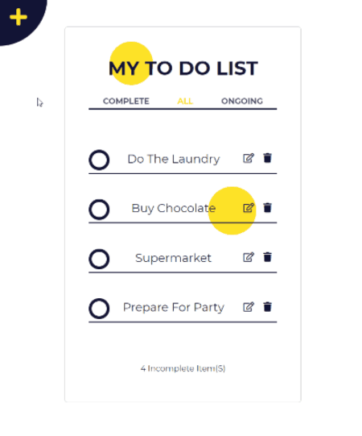

# My first front-end framework: React

 A small Todo application that lives in the browser, provides you a place to write down your tasks. 
 You can add, edit, categorized different tasks, and the list will be saved to the local storage of the browser in every edit.
 

 Live Version in Netlify - [To Do App](https://todo-app-by-react.netlify.app)

## Objectives

- Get used to "think in React"
- Use state, effect hooks and ref for managing and reactivity
- Organize the app in different components
- Store information with user's local storage

### Tools

- VS Code
- React